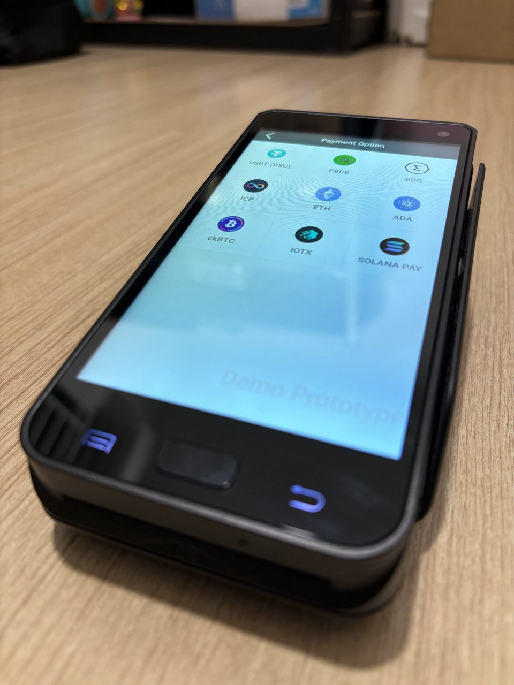
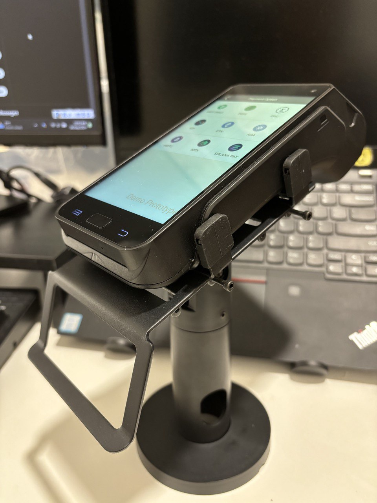

# TabbyPOS-Introduction
#### Web3 Crypto POS | Bringing decentralized payments to real-world businesses 
TabbyPOS is a cryptocurrency point-of-sale (POS) system based on Malaysia that enables merchants to accept crypto payments seamlessly. It supports multiple blockchains, including Ergo, IoTeX, ICP, and Solana, providing a fast, secure, and efficient transaction experience. With TabbyPOS, merchants can easily integrate crypto payments into their businesses while benefiting from a decentralized and scalable infrastructure.

## The achievements of TabbyPOS so far： 
1. 🏆Received funding support from ICP Dfinity Foundation，and successfully completed the designated milestones. 
2. 🏆Received funding support from Solana Foundation，and successfully completed the designated milestones. 
3. 🚀TabbyPOS already has an MVP product, with only 20% progress remaining before full commercial deployment. 
4. 🏪Currently, 10 merchants are actively testing the system.

#### The chains successfully integrated are as follows: 
1. ✅ Ergo
2. ✅ ICP 
3. ✅ Solana
4. ✅ Pi Network
5. ✅ BSC

#### The chains currently integrating are as follows:  
1. 🔥TRON
2. 🔥BitGet Wallet

## Our Client 
TabbyPOS has not officially started sales yet. We are preparing for an official market launch in Q2 2025. 

## Social 
- 🐦 Twitter : https://x.com/tabbypos 
- ✈️ Telegram (EN) : https://t.co/TCS1rxjBTL 
- ✈️ Telegram (CN) : https://t.co/HxM3QZOxRC 
- 🔗 Website ：https://www.tabbylab.io/ 

## Team Info 
**Lee Koh Ching** 
Full Stack Developer 
LinkedIn : https://www.linkedin.com/in/koh-ching-lee-7b120756/ 

**Teh Chiou Shing** 
Business Development 
Social link : https://twitter.com/Cstehbeauty 

## Token Info
### $EPOS 
EPOS is a token we issued in 2023 for fundraising. At that time, we raised tens of thousands, but as we were still new to the crypto space, we lacked experience in managing it. After going through the bear market, the funds we raised have significantly depreciated. However, we never gave up—despite the lack of funding, we continue to build with passion and dedication.  
$EPOS holders will share the revenue generated by TabbyPOS through airdrops.
Remarks: Currently, we do not encourage trading as we are waiting for the ERGO Rosen team to enable cross-chain functionality to BSC. Once available, the majority of our liquidity will be migrated to the BSC
  
- ⛓️ Chain : Ergo Platform (Will Bridge to BSC SOON!!)  
- 📈 Market Cap : $100,325 (Last Update : 05 Feb 2025) 
- 🏦 DEX : https://shorturl.at/CqYSL 
- 🏦 CEX : https://nonkyc.io/market/EPOS_USDT  

### $TABBY 🔥🔥 
TABBY was initially a test token I created while integrating with Solana. One day, it unexpectedly gained traction on PumpFun and successfully launched. Given Solana's recent surge in popularity, we have officially announced that we will manage and maintain this token as either a meme for TabbyPOS or a symbolic representation of the project.  
$TABBY holders will share revenue generated by TabbyPOS on the Solana chain through airdrops. $TABBY is currently experiencing a surge in popularity, so we are dedicating more time and effort to managing and growing the token.  

- ⛓️ Chain : Solana 
- 📈 Market Cap : $264,000 (Last Update : 05 Feb 2025) 
- 🏦 DEX : https://raydium.io/  
- 📜 CA : CGn6Tmpqy7wyD22XxCnDoyGQwqodMPTrUwGsmX5rpump  

### Revenue Model 💵💵 
1. 📱 Selling POS devices
2. 📦 Providing OEM services for POS hardware and software
3. 🛠 Offering customized software development services
4. 💰 Crypto fiat exchange fees (TabbyPOS 2.0)

### Do merchants receive tokens or cryptocurrency?
- TabbyPOS 1.0 Merchants will receive cryptocurrency
- TabbyPOS 2.0 Integrated with exchanges, allowing merchants to convert cryptocurrency directly into fiat currency

### Short-Term Goals
- Refine the product, drive commercialization, enhance branding, achieve successful market adoption, and generate revenue.

### Long-Term Goals
- Obtain a license for cryptocurrency-to-fiat conversion (cryptocurrency exchange license).

  
## 📺 Watch the Demo 
[BSC Pay Demo](https://x.com/i/status/1896966445701173386)
  
[Solana Pay Demo](https://x.com/tabbypos/status/1871878777942536606/video/1)
  
[ICP Pay Demo](https://x.com/i/status/1791378929812705525)
  
## 🖼️ Product Image 

 

