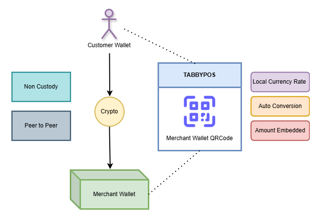
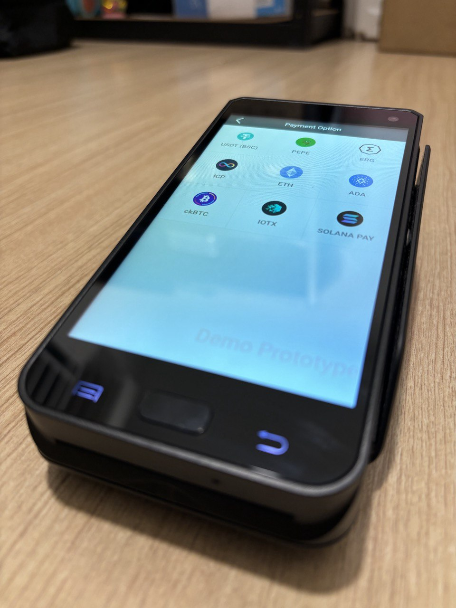
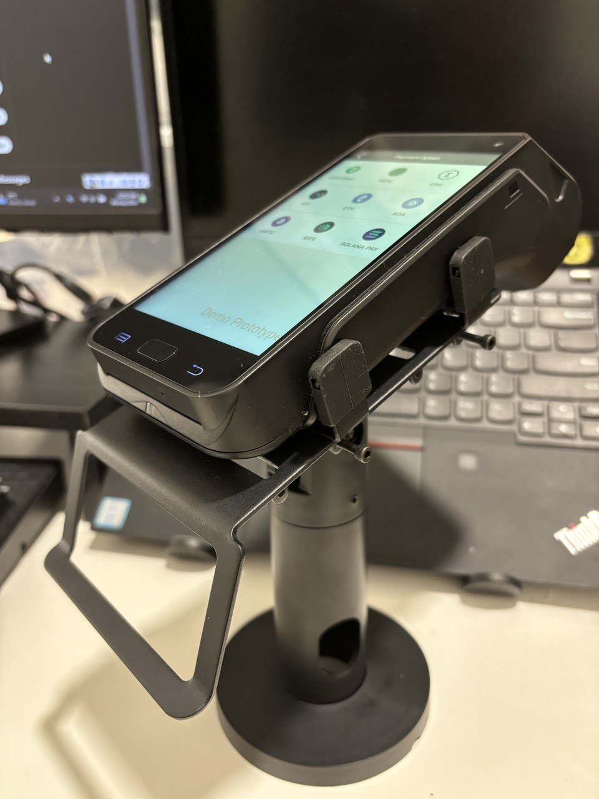

# TabbyPOS-Introduction
#### Web3 Crypto POS | Bringing decentralized payments to real-world businesses 
TabbyPOS is a cryptocurrency point-of-sale (POS) system that enables merchants to accept crypto payments seamlessly. It supports multiple blockchains, including Ergo, IoTeX, ICP, BSC, APTOS, Pi Network and Solana, providing a fast, secure, and efficient transaction experience. With TabbyPOS, merchants can easily integrate crypto payments into their businesses while benefiting from a decentralized and scalable infrastructure.

## The achievements of TabbyPOS so far： 
1. 🏆Received funding support from ICP Dfinity Foundation，and successfully completed the designated milestones. 
2. 🏆Received funding support from Solana Foundation，and successfully completed the designated milestones. 
3. 🏆Received funding support from Aptos Foundation，and successfully completed the designated milestones. 
4. 🏆Won 3rd place in the GUI INU Hackathon. 
5. 🚀TabbyPOS is now available on Google Play Store. 

#### The chains successfully integrated are as follows: 
1. ✅ Ergo
2. ✅ ICP 
3. ✅ Solana
4. ✅ Pi Network
5. ✅ BSC
6. ✅ APTOS

#### The chains currently integrating are as follows:  
1. 🔥TRON
2. 🔥BitGet Wallet

## How its work ?    
TabbyPOS adopts a peer-to-peer payment method, where cryptocurrency is transferred directly from the user's wallet to the merchant's wallet. We do not handle or custody any assets, so there are no compliance issues related to asset custody or transfers. Our device integrates multi-chain functionality and is equipped with a backend system for viewing payment records, making payments more convenient and management more efficient for merchants and customers.
  

 

## Our Client 
TabbyPOS has not officially started sales yet. We are preparing for an official market launch in Q2 2025. 

## Social 
- 🐦 Twitter : https://x.com/tabbypos 
- ✈️ Telegram : https://t.co/TCS1rxjBTL 
- 🔗 Website ：https://www.tabbylab.io/ 

## Team Info 
**Lee Koh Ching** 
Full Stack Developer 
LinkedIn : https://www.linkedin.com/in/koh-ching-lee-7b120756/ 

**Teh Chiou Shing** 
Business Development 
Social link : https://twitter.com/Cstehbeauty 

## Token Info
### $TABBY 
- ⛓️ Chain : BSC  
- 🏦 DEX : https://shorturl.at/6o6Xa 
- 🏦 CEX : https://nonkyc.io/market/TABBY_USDT 
- 🛠 DEX Screener : https://dexscreener.com/bsc/0x5f97840b40dfe20b620604ab13f71c709a28cb6b 
- 📜 CA  : 0x319558c8aD708dc42f45ab70eADA4750d6c942d7

### Revenue Model 💵💵 
1. 📱 Selling POS devices
2. 📦 Providing OEM services for POS hardware and software
3. 🛠 Offering customized software development services
4. 💰 Crypto fiat exchange fees (TabbyPOS 2.0)
5. 💰 Listing Fee

### Do merchants receive tokens or cryptocurrency?
- TabbyPOS 1.0 Merchants will receive cryptocurrency
- TabbyPOS 2.0 Integrated with exchanges, allowing merchants to convert cryptocurrency directly into fiat currency

### Short-Term Goals
- Refine the product, drive commercialization, enhance branding, achieve successful market adoption, and generate revenue.

### Long-Term Goals
- Obtain a license for cryptocurrency-to-fiat conversion (cryptocurrency exchange license).

  
## 📺 Watch the Demo 
[BSC Pay Demo](https://x.com/i/status/1896966445701173386)
  
[Solana Pay Demo](https://x.com/tabbypos/status/1871878777942536606/video/1)
  
[ICP Pay Demo](https://x.com/i/status/1791378929812705525)
  
[Aptos Pay Demo](https://x.com/i/status/1924150206830088688)
  

## 🖼️ Product Image 

 

